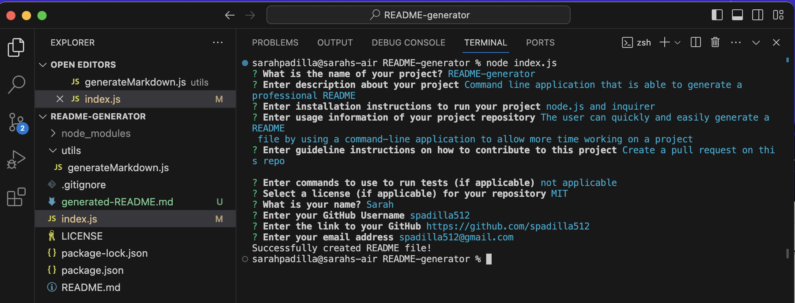
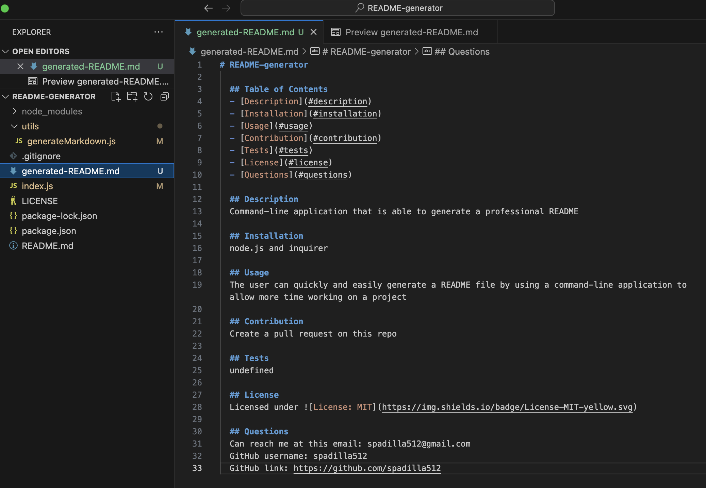

# README-generator

## Table of Contents

- [Description](#description)
- [User Story](#user-story)
- [Acceptance Criteria](#acceptance-criteria)
- [Installation](#installation)
- [Images](#images)
- [Link to Video Walkthrough](#link-to-video-walkthrough)
- [Credits](#credits)
- [License](#license)

## Description

When creating an open source project on Github, it's important to have a high-quality README for the app. This should include what the app is for, how to use the app, how to install it, how to report issues, and how to make contributions-this last part increases the likelihood that other developers will contribute to the success of the project. The user can quickly and easily generate a README file by using a command-line application to generate one. This allows the project creator to devote more time working on the project.

## User Story

As a developer
I want a README generator
So that I can quickly create a professional README for a new project

## Acceptance Criteria

GIVEN a command-line application that accepts user input
WHEN I am prompted for information about my application repository
THEN a high-quality, professional README.md is generated with the title of my project and
sections entitled Description, Table of Contents, Installation, Usage, License, Contributing, 
Tests, and Questions
WHEN I enter my project title
THEN this is displayed as the title of the README
WHEN I enter a description, installation instructions, usage information, contribution
guidelines, and test instructions
THEN this information is added to the sections of the README entitled Description,
Installation, Usage, Contributing, and Tests
WHEN I chooser a license for my application from a list of options
THEN a badge for that license is added near the top of the README and a notice is added to the
section of the README entitled License that explains which license the application is covered under
WHEN I enter my Github username
THEN this is added to the section of the README entitled Questions, with a link to my Github profile
WHEN I enter my email address
THEN this is added to the section of the README entitled Questions, with instructions on how to 
reach me with additional questions
WHEN I click on the links in the Table of Contents
THEN I am taken to the corresponding section of the README

## Installation

To install inquirer, please use 'npm i inquirer@8.2.4' in terminal.

## Images

### Terminal

### Generated README

### Live Preview README

## Link to Video Walkthrough

**Video:** [Link]()

## Credits

The starter code for the index.js and generateMarkdown.js for this project was used from a repository named potential-enigma located in the Develop and utils folder which can be accessed through the following link: https://github.com/coding-boot-camp/potential-enigma.git

License Badges: https://gist.github.com/kofiav/c1059e1075b67582e86b07aa9759e20d

## License
